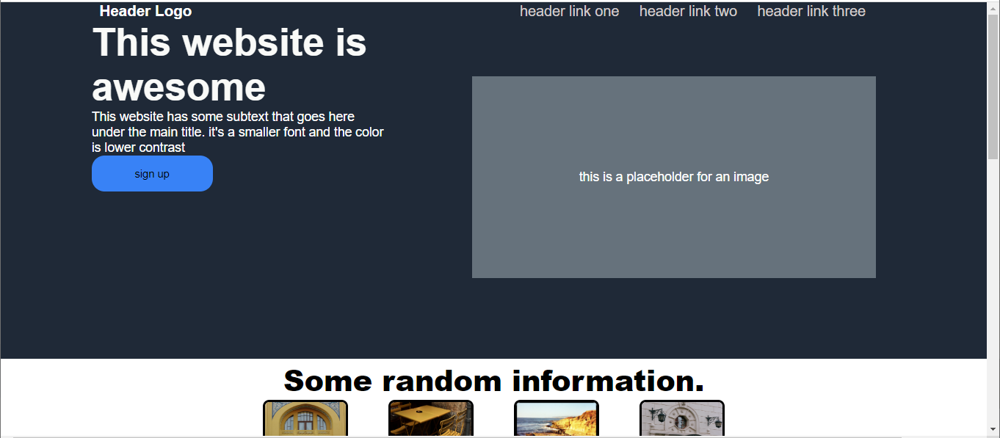

# Odin landing page

> A landing page using semantic html tags and css flex box



## Built With

- ### HTML5 elements
  - **Heading element**`h2` `h3`
  - **Block element** `div` `p` `blockquote`
  - **inline element**`button`
- ### CSS properties
  - CSS @import Rule using `@import` to import a style sheet into another style sheet
  - CSS background for page aesthetic using `background-color`
  - CSS selectors `class selector` `id selector` `universal selector`
- ### Linters
  - [prettier](prettier),
  - [stylelint](stylelint).

### GitHub Action

## Live Demo

[Live Demo Link](https://yinkusadel-top-landing-page.netlify.app)

### Development (Running locally)

- Clone the project

```bash
git clone https://github.com/Yinkusadel/odin-landing-page/pull/1

```

- Install Dependencies

```bash
yarn install
```

To run StyleLint by itself, you may run the lint task:

```bash
yarn lint:check
```

Or to automatically fix issues found (where possible):

```bash
yarn lint
```

You can also check against Prettier:

```bash
yarn format:check
```

and to have it fix (to the best of its ability) any format issues, run:

```bash
yarn format
```

You can also check against Webhint:

```bash
yarn hint
```

## Style Guides

- [CSS Style Guide](http://udacity.github.io/frontend-nanodegree-styleguide/css.html)
- [HTML Style Guide](http://udacity.github.io/frontend-nanodegree-styleguide/index.html)
- [Git Style Guide](https://udacity.github.io/git-styleguide/)

## 👤 Author

- Github: [@yinkusadel](https://github.com/yinkusadel)
- Twitter: [@HashiraAdel](https://twitter.com/HashiraAdel)
- Linkedin: [@adeleyeolayinka](https://www.linkedin.com/in/adeleye-olayinka/)

## 🤝 Contributing

Contributions, issues and feature requests are welcome!

Feel free to check the [issues page](../../issues).

## Show your support

Give a ⭐️ if you like this project!

## Acknowledgments

- T.O.P: [@T.O.P-landing-page](https://www.theodinproject.com/lessons/foundations-landing-page)
- Photo by Jill Evans from: [Pexels](https://www.pexels.com/photo/landscape-photography-of-cliff-3539517/)
- Photo by Efrem Efre from: [Pexels](https://www.pexels.com/photo/yellow-foldable-chairs-and-tables-on-the-concrete-pavement-13762172/)
- Photo by Beyza Kaplan from: [Pexels](https://www.pexels.com/photo/entrance-to-a-building-13475585/)
- Photo by Valeria Nikitina from: [Pexels](https://www.pexels.com/photo/a-door-to-a-building-9678168/)

## 📝 License

[MIT licensed](./LICENSE).
